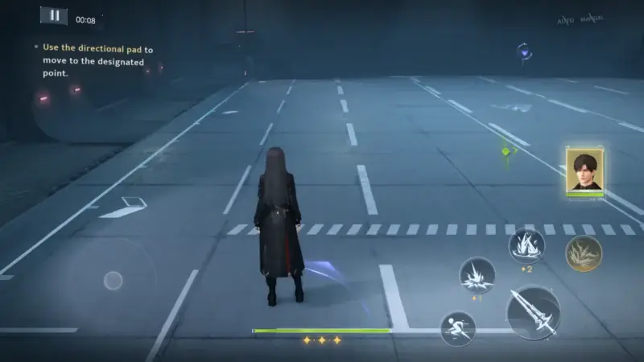
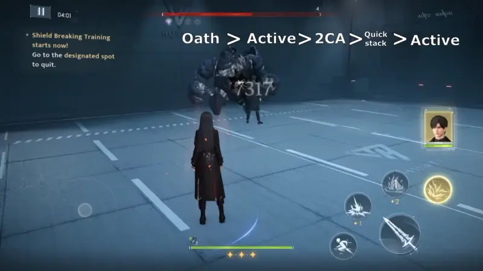

# Introduction
When used properly, the claymore is the strongest of the hunter weapons and is often recommended when trying to pass stages with low stats. However, using the claymore properly requires understanding, patience and practice. 

The hunter claymore can be used with any companion, but will require a full ATK build on the team’s cores, regardless of what your companion scales off of. This means that while the claymore compliments a lot of ATK scaling companions, pairing it with a DEF or HP scaling companion means that you will lose out on the companion damage. This is not to say you CAN’T do so, but the majority of damage dealt will rely heavily on just MC and her claymore. 

Best users of the claymore: 
- All free 4 companions
- Xavier’s Standard Myth: Lightseeker
- Rafayel’s Standard Myth: Abysswalker
- Sylus’ Standard Myth: Relentless Conquerer

*Please see companion guides for tips on how to use the claymore with each individual kit.*
# How to Use the Hunter Claymore
## Basic & Charged Attacks
> [!column | flex]
>
> > [!note | no-title clean]
> > 
> ><Carousel>
> >
> >
> ></Carousel>
>
> > [!note | no-title clean]
> > 
> > The claymore’s **normal attack** chain has four hits that are heavy and slow, and should **not** be used in the full chain combo in normal battle. When used like this, the claymore will do less damage than the hunter guns. Instead, **only use the claymore’s charged attack**. It is still slow, but the charged attack does so much damage that it is worth it. However, this charged attack has an extremely long recovery animation that **should be dodge/dash cancelled** to allow you to continue dealing heavy damage.

## Active Skill
> [!column | flex]
>
> > [!note | no-title clean]
> > 
> ><Carousel>
> >
> >
> ></Carousel>
>
> > [!note | no-title clean]
> > 
> > There are two versions of the active skill: normal and fully charged. The fully charged active is also called a “frangere slash”, or sometimes “frangere/frang” for short. It deals massive damage and is a large part of what makes the claymore so strong. However, the charge time is very long and a waste of time in actual combat so we use the claymore’s calibrate mechanic instead.

>[!warning] Never use normal active skill
>Never use normal active skill. Always use frangere with calibrating mechanic that is explained below.

## Calibrating for Frangere Slash
> [!column | flex]
>
> > [!note | no-title clean]
> > 
> ><Carousel>
> >
> >
> ></Carousel>
>
> > [!note | no-title clean]
> > 
> > Let’s take a look at the claymore’s normal attacks again. When button smashing the attack button, there is no break in between slashes, which is the wrong way to play the claymore. Instead, practice tapping the attack button slowly so that an orange-yellow ring forms around MC after each hit. 
> > 
> > You can think of calibration stacks like a rhythm game - you can’t be too early or too late to start the next attack or you’ll miss the calibration. You can even use audio cues like a rhythm game - turn up the volume and you will hear a “shing” sound every time the ring forms. Use this as a trigger to tap the attack button.
> > 
> > When you tap the attack button when the ring forms, you calibrate (or “stack”), and you can do so up to three times. Any further calibrating / stacking will not count. You can see your calibration count above the HP bar as an icon. Once you have three stacks, tapping the active button will automatically trigger the fully charged version, and you go back to having 0 stacks. If you only have 1 or 2 stacks, and you will initiate a normal active hit but will not clear the stacks you already have.

>[!warning] Stacks
>Always keep an eye on your stack count to not waste damage!

## Calibrating with Charged Attacks
> [!column | flex]
>
> > [!note | no-title clean]
> > 
> >
>
> > [!note | no-title clean]
> > 
> > Another way to calibrate the claymore is to dash, stop moving, and then hit the attack button. This is possibly one of the hardest parts of claymore gameplay to practice. For most players, the instinct is often to always have your left thumb on the D-Pad to be able to control your MC’s movement. This will NOT trigger the calibration ring. Instead, MC has to momentarily stop moving after a dash. This, again, is like a rhythm game. 
> > 
> > To understand the mechanic, we recommend going into a training room and start practicing dodging and then attacking without using the D-Pad at all. This will seem weird at first, but it is a good way to get familiar with the timing. After tapping the dodge button, MC will move backwards and at the end of the animation, a calibration ring will form, and pressing the attack button will have the same effect as calibrating with a basic attack chain. It is best to practice with charged attacks instead of just basic attacks.

> [!column | flex]
>
> > [!note | no-title clean]
> > 
> >
>
> > [!note | no-title clean]
> > 
> > Once you get comfortable with the timing, you can start to practice with the D-Pad to move MC into a useful position for attacking the enemy. Instead of holding the D-Pad directions down constantly, practice just tapping it in the direction you need before calibrating (or alternatively, just letting go of the DPad when you dash. 

## Quick Calibrate
> [!column | flex]
>
> > [!note | no-title clean]
> > 
> >
>
> > [!note | no-title clean]
> > 
> > Now that you have learned to calibrate by dashing and then attacking, you can also do what is called “quick calibrate” which is calibrating without doing the full attack animation(s). While quick calibrations do not deal any damage, it is still useful to get the stacks, especially at the beginning of a stage when you have to run to the start beacon anyway. Quick calibration at the beginning of the stage to get all three stacks means that once battle starts, you will be able to do a frangere slash immediately (or right after resonance, depending on needs). This saves time and increases your overall damage output.

## Putting It All Together
Now that you are comfortable with the individual parts of claymore gameplay, it’s time to pull it all together. Combine stacking with charged attacks and then use your active to get the maximum claymore damage output. There are many ways this can be done depending on stage / enemy needs.

> [!column | flex]
>
> > [!note | no-title clean]
> > 
> ><Carousel>
> >
> >
> ></Carousel>
>
> > [!note | no-title clean]
> > 
> > - 3CA > active: This is the most “brain dead” version since you will eventually develop muscle memory for the rhythm, and it becomes just a habit.

> [!column | flex]
>
> > [!note | no-title clean]
> > 
> >
>
> > [!note | no-title clean]
> > 
> > - 2CA > quick calibrate > active: This requires some focus, to keep track of stack counts and then to interrupt the muscle memory of “Dodge-calibrate-CA”

> [!column | flex]
>
> > [!note | no-title clean]
> > 
> >
>
> > [!note | no-title clean]
> > 
> > - Quick calibrate x3 > active

>[!note | no-title clean]
> - Any combination of CA and quick calibrating. Most mob stages with claymore will use this option, combined with some grouping.

# Fighting Bosses
While fighting mobs with claymore isn’t so strict because you will have to move around a bit to group enemies so you will just use charged attacks and actives whenever needed, fighting bosses requires following a proper rotation.
## Weakness Rotations
It is recommended to follow one of the rotations below to maximize damage while an enemy boss is in weakness. First rotation is  the easiest to achieve for beginners. Last rotation is advanced level and maximizes damage in weakness, but it is also the hardest to do because of how quick you have to execute the order.

<Carousel>

</Carousel>

>[!warning] Oath in rotation
>When you need to fit oath in weakness, try to do it at the very beginning or at the very end of the rotation so that you do not interrupt the rotations and miss the second active skill.

## EEB Requirements
It is recommended to have at least 40 EEB to be able to use the weakness rotations and still have enough energy to use your resonance skill. If you cannot achieve this (underleveled cores, or needing to use one of the cores for ORB), we recommend adjusting your gameplay to conserve energy - which method to use will depend on the enemy:
- If stella matching: do not use active skills outside of weakness.
- If brute forcing: alternate between reso > active > CA until reso CD is over and reso > CA until reso CD is over. Try to time it so that you can do the active in weakness.
- Do not use the fully weakness rotation - only use one active and fill the rest of the time with charged attacks. If doing this in combination with one of the above methods, you do not have to stack inside weakness - this should allow you to comfortably use Active > 3CA. Re-obtain stacks when attacking the shielded boss.

---
v1.0 by @jayci  Proofreading by @