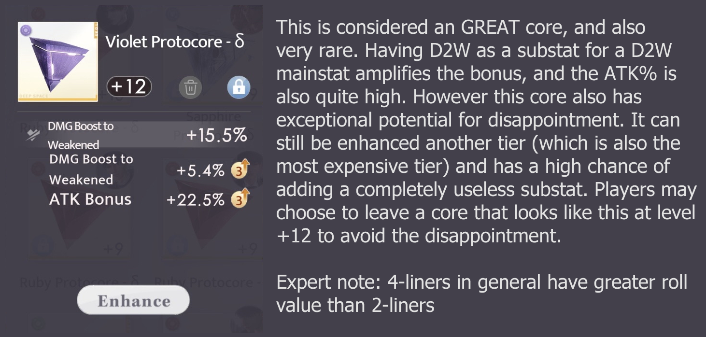
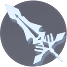
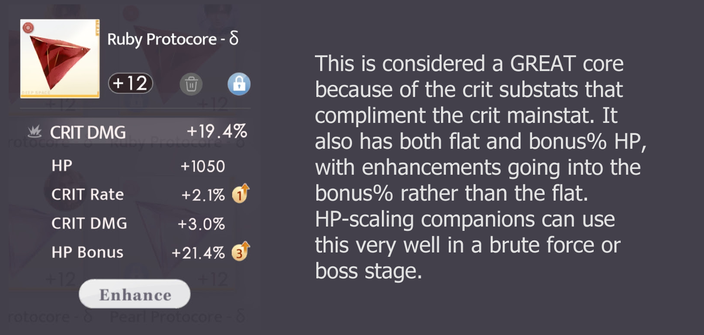
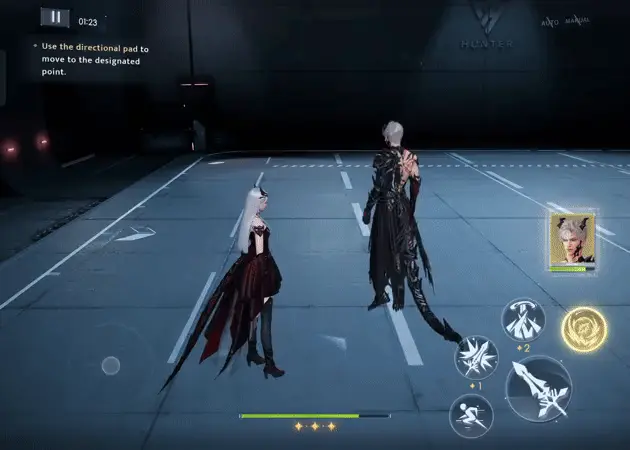
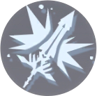
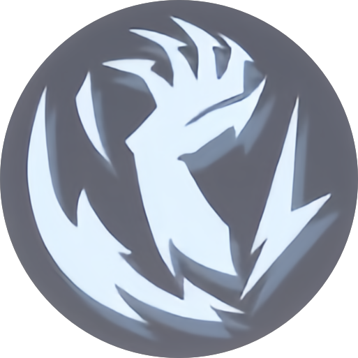
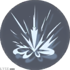
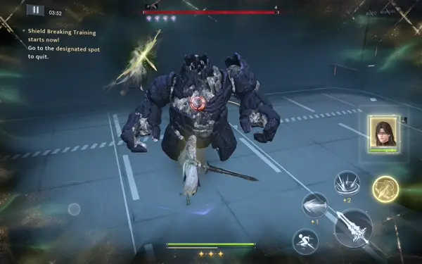

>[!infobox]
>
>
>## Sylus: Silverwing Fiend
>
>![[_.png]]
>
>| Stella | Sapphire / Blue |
> | --- | --- |
> | Weapon | Wand |
> | Scaling stat | DEF |

Sylus: Silverwing Fiend is a DEF scaling companion that specialises in stella-matched battles. His rotation focuses on enhancing charged attacks and high nuke damage from his special state skill.

> [!column | flex]
>
> > [!note | clean] Strengths
> > - Large burst damage from special state.
> > - One of the easier rotations to learn in the 3rd myth generation, with flexibility when not trying to min-max.
>
> > [!note | clean] Weaknesses
> > - All rank bonuses only buff the special state.
> > - EEB hungry in stella-matched battles, especially at R-1.
> > - Rotation timing can be tight when trying to min-max.

---
## Quick Summary
If you don't know what acronyms means, you can find them in [[Glossary]].

![[Silverwing Fiend#Core Recommendations| clean]]

#### Rotation
##### Normal State
>[!error | no-icon] Stella-Matched, all ranks
>Active -- Reso -- Support + CA -- (3BA dash) x2 -- CA -- (3BA dash) x2 -- CA -- Active -- Reso

>[!error | no-icon] Brute Force
>WIP

##### Special State: Crimson Bond (CB)
>[!error | no-icon] R0
>Crimson Bond -- 3CA -- Hold Active -- 2CA -- Special Reso

>[!error | no-icon] R1+
>Crimson Bond -- Hold Active -- 2CA -- Hold Active -- 2CA -- Special Reso

---
## Signature Weapon: Crimson Malison
>[!column | flex]
>
>>[!skills | clean no-t]
>>
>>
>
>>[!skills | clean no-t]
>>
>>

>><table>
>>    <tr>
>>        <td rowspan="2" width="60"></td>
>>        <td style="vertical-align: top; padding: 0.4rem 0.7rem; font-weight: bold; font-size: 150%;">Rose Spike</td>
>>    </tr>
>>    <tr>
>>        <th style="vertical-align: top;">Basic Attack</th>
>>    </tr>
>>    <tr>
>>        <td colspan="2">Up to 4 attacks in a full combo string.</td>
>>    </tr>
>></table>
>>

>[!column | flex]
>
>>[!skills | clean no-t]
>>
>><Carousel>
>>
>>
>></Carousel>
>>
>>
>
>>[!skills | clean no-t]
>>
>>

>><table>
>>    <tr>
>>        <td rowspan="2" width="60"></td>
>>        <td style="vertical-align: top; padding: 0.4rem 0.7rem; font-weight: bold; font-size: 150%;">Rose Spike</td>
>>    </tr>
>>    <tr>
>>        <th style="vertical-align: top;">Charged Attack</th>
>>    </tr>
>>    <tr>
>>        <td colspan="2">Sylus’ passive skill grants you a fully charged rose mark (RM) when entering battle. Hitting an enemy with a charged attack when RM is fully charged will consume RM to do extra damage (shown as larger red spikes). Charged attacks without RM will do normal charged attack damage.</td>
>>    </tr>
>></table>
>>

>[!column | flex]
>
>>[!skills | clean no-t]
>>
>>
>
>>[!skills | clean no-t]
>>
>>

>><table>
>>    <tr>
>>        <td rowspan="2" width="60"></td>
>>        <td style="vertical-align: top; padding: 0.4rem 0.7rem; font-weight: bold; font-size: 150%;">Rose Scent</td>
>>    </tr>
>>    <tr>
>>        <th style="vertical-align: top;">Active Skill (10s CD) (1 energy cost)</th>
>>    </tr>
>>    <tr>
>>        <td colspan="2">Does no damage at time of casting but for the next 8s, all your other damage increases by 15%. Also makes you unstoppable for 8s.</td>
>>    </tr>
>></table>
>>

>[!note | clean no-t]
>

><table>
>    <tr>
>       <td rowspan="2" width="60"></td>
>       <td style="vertical-align: top; padding: 0.4rem 0.7rem; font-weight: bold; font-size: 150%;">Rose Rain</td>
>    </tr>
>    <tr>
>        <th style="vertical-align: top;">Passive skill</th>
>    </tr>
>    <tr>
>        <td colspan="2">When in the CB special state, the active skill is replaced by a special active skill - see below for more information about Sylus’ special state.</td>
>    </tr>
></table>
>

## Companion skills
>[!column | flex]
>
>>[!skills | clean no-t]
>>
>><Carousel>
>>
>>
>></Carousel>
>
>>[!skills | clean no-t]
>>
>>

>><table>
>>    <tr>
>>        <td rowspan="2" width="60"></td>
>>        <td style="vertical-align: top; padding: 0.4rem 0.7rem; font-weight: bold; font-size: 150%;">Crimson Break</td>
>>    </tr>
>>    <tr>
>>        <th style="vertical-align: top;">Support skill (10s CD)</th>
>>    </tr>
>>    <tr>
>>        <td colspan="2">Sylus shoots a ray of energy in a straight line at enemies. Empowered support skill: Deals additional damage on top of normal support skill damage.</td>
>>    </tr>
>></table>
>>

>[!note] Support inside Crimson Bond
>Crimson Break becomes Crimson Void inside the CB special state and cannot be manually activated - see below for more information about Sylus’ special state.

>[!column | flex]
>
>>[!skills | clean no-t]
>>
>>
>
>>[!skills | clean no-t]
>>
>>

>><table>
>>    <tr>
>>        <td rowspan="2" width="60"></td>
>>        <td style="vertical-align: top; padding: 0.4rem 0.7rem; font-weight: bold; font-size: 150%;">Crimson Coffin</td>
>>    </tr>
>>    <tr>
>>        <th style="vertical-align: top;">Resonance skill (15s CD) (2 energy cost)</th>
>>    </tr>
>>    <tr>
>>        <td colspan="2">Consume two energy charges to break 1 protocore shield (2 when stella matched) with one hit. It will also group mobs in the area.</td>
>>    </tr>
>></table>
>>

>[!column | flex]
>
>>[!skills | clean no-t]
>>
>>
>>Above animation shows: resonance (20), ba-ca+rose mark (3+3+12), 4ba (3+3+3+3), ba-ca (3+3), ba-ca+rose mark (3+3+12), support skill(6)
>
>>[!skills | clean no-t]
>>
>>

>><table>
>>    <tr>
>>        <td rowspan="2" width="60"></td>
>>        <td style="vertical-align: top; padding: 0.4rem 0.7rem; font-weight: bold; font-size: 150%;">Crimson Seal</td>
>>    </tr>
>>    <tr>
>>        <th style="vertical-align: top;">Passive skill</th>
>>    </tr>
>>    <tr>
>>        <td colspan="2"><li>Sylus gives you a Rose Mark that takes 10s to recover. This skill is covered in the weapons details section above.<li>Sylus’ special state (Crimson Bond) becomes available when the yellow bar below MC’s HP is filled (100 points). Certain attacks that land on enemies will charge the bar - from most charge to least charge per attack: resonance skill > rose mark > support skill > basic & normal charged attacks. Normal active skills do not hit enemies, so using it does not fill the bar. None of Sylus’ own attacks contribute to the filling the bar.</li></td>
>>    </tr>
>></table>
>>

### Special State: Crimson Bond (CB)
In the CB special state, the support, active and resonance skill button functions are all changed. CB has no time limit and can last forever if you do not activate the special resonance skill (UR). The goal during CB is to “grow” flowers on the field to maximise UR damage - flowers are stimulated to grow when you use basic/charged attacks and active skills.

>[!column | flex]
>
>>[!skills | clean no-t]
>>
>><Carousel>
>>
>>
>></Carousel>
>
>>[!note | clean no-t]
>>

>><table>
>>    <tr>
>>       <td rowspan="2" width="60"></td>
>>       <td style="vertical-align: top; padding: 0.4rem 0.7rem; font-weight: bold; font-size: 150%;">Bloodrose Rain</td>
>>    </tr>
>>    <tr>
>>        <th style="vertical-align: top;">Active Skill</th>
>>    </tr>
>>    <tr>
>>        <td colspan="2">Uses no energy to buff your damage while also firing bullets at the enemy. Every time you use the special active skill, its cooldown extends by 4s (to a maximum of 40s). Holding the active skill button fires more bullets - enough to produce a rose on the field (max 2 at a time). Always hold the active button to grow roses with most efficiency.</td>
>>    </tr>
>></table>
>>

>[!column | flex]
>
>>[!skills | clean no-t]
>>
>>
>
>>[!note | clean no-t]
>>

>><table>
>>    <tr>
>>       <td rowspan="2" width="60"></td>
>>       <td style="vertical-align: top; padding: 0.4rem 0.7rem; font-weight: bold; font-size: 150%;">Crimson Void</td>
>>    </tr>
>>    <tr>
>>        <th style="vertical-align: top;">Support skill</th>
>>    </tr>
>>    <tr>
>>        <td colspan="2">You cannot manually activate Sylus’ support skill while in CB. Instead, it is automatically triggered once a flower grows on the field (usually after the hold-active skill). It is indicated by the blood spikes that shoot up from the ground underneath the enemy.</td>
>>    </tr>
>></table>
>>

>[!column | flex]
>
>>[!skills | clean no-t]
>>
>><Carousel>
>>
>>
>>
>></Carousel>
>
>>[!note | clean no-t]
>>

>><table>
>>    <tr>
>>       <td rowspan="2" width="60"></td>
>>       <td style="vertical-align: top; padding: 0.4rem 0.7rem; font-weight: bold; font-size: 150%;">Underworld Rift (UR)</td>
>>    </tr>
>>    <tr>
>>        <th style="vertical-align: top;">Resonance Skill (8s CD)</th>
>>    </tr>
>>    <tr>
>>        <td colspan="2">This skill consumes no energy and cannot be used to break protocore shields. If UR is used when the enemy is weakened, it will pause the weakness bar timer while the animation plays. UR deals massive damage and can be enhanced further by automatically consuming roses that are on the field at the time of using the skill. Each rose consumed will increase UR’s damage by 30% and is indicated by an additional “window/door” in the UR animation.</td>
>>    </tr>
>></table>
>>

## Active Pair Bonuses
- **R0** - Regenerate 0.5 energy whenever you do an enhanced charged attack (consuming Rose Mark)
- **R1** - Normal state enhanced charged attacks (rose mark) and Sylus’s support skill in the CB special state have their damage increased by 10% - both also have some crowd control and will draw enemies in. When entering the CB special state, your special active skill is immediately ready and has reduced cooldown (you can now use it twice in a single weakness state).
- **R2** - Enemies hit by Sylus’ support in the CB special state take 8% increased damage for 6s. When a rose is grown in the CB special state, you and Sylus both also heal 5% max HP.
- **R3** - Sylus deals 10% more damage in the CB special state and your active skill grants a larger damage buff. Basic and charged attacks also do more damage.
## Core Recommendations
[[Protocores basics|In-depth core guide]]

<table>
    <tr>
        <th colspan="2">Stella Matched</th>
    </tr>
    <tr>
        <td rowspan="3"></td>
        <td>R0: OO / Energy Orbit: 1 EEB + 1 ORB 3* SHC & FOO: 1 EEB + 1 DEF / OS</td>
    </tr>
    <tr>
        <td>R1+: 1 EEB + 1 DEF / OS</td>
    </tr>
    <tr>
        <td>R-1: 2 EEB</td>
    </tr>
    <tr>
        <td></td>
        <td>4 d2w OR 1crit rate + 3 d2w OR 1 crit rate + 1 crit dmg + 2 d2w</td>
    </tr>
    <tr>
        <td>Substats Priority</td>
        <td>DEF% > Flat DEF/Crit/d2w > ATK% > Flat ATK > OS</td>
    </tr>
    <tr>
        <th colspan="2">Brute Force WIP</th>
    </tr>
    <tr>
        <td rowspan="2"></td>
        <td>R0: OO / Energy Orbit:  3* SHC & FOO: </td>
    </tr>
    <tr>
        <td>R1+: </td>
    </tr>
    <tr>
        <td></td>
        <td>3 crit rate + 1 crit dmg OR 2 crit rate + 2 crit dmg</td>
    </tr>
    <tr>
        <td>Substats Priority</td>
        <td>DEF% > Flat DEF/Crit/d2w > ATK% > Flat ATK > OS</td>
    </tr>
</table>

Once your CR team achieves 4,800 DEF, it is recommended to start building for D2W/Crit instead of def.

##### About EEB
The rotations suggested in this guide require high EEB to execute without any delays. If you do not have enough EEB, you may end up not using your Active Skill buff as often, meaning less than optimized damage. In general, the damage buff from consistently using the active skill is more valuable than the additional 10.5% def bonus from using a maxed def cube core mainstat instead of an EEB, assuming core substats are similar.

## Recommended Rotations
CR performs best when using his signature weapon. It is NOT recommended to use the hunter claymore at all unless you intend to completely ignore the companion kit and depend only on the hunter claymore’s raw damage.

### R0

### R-1

### R1

### R2 & R3
